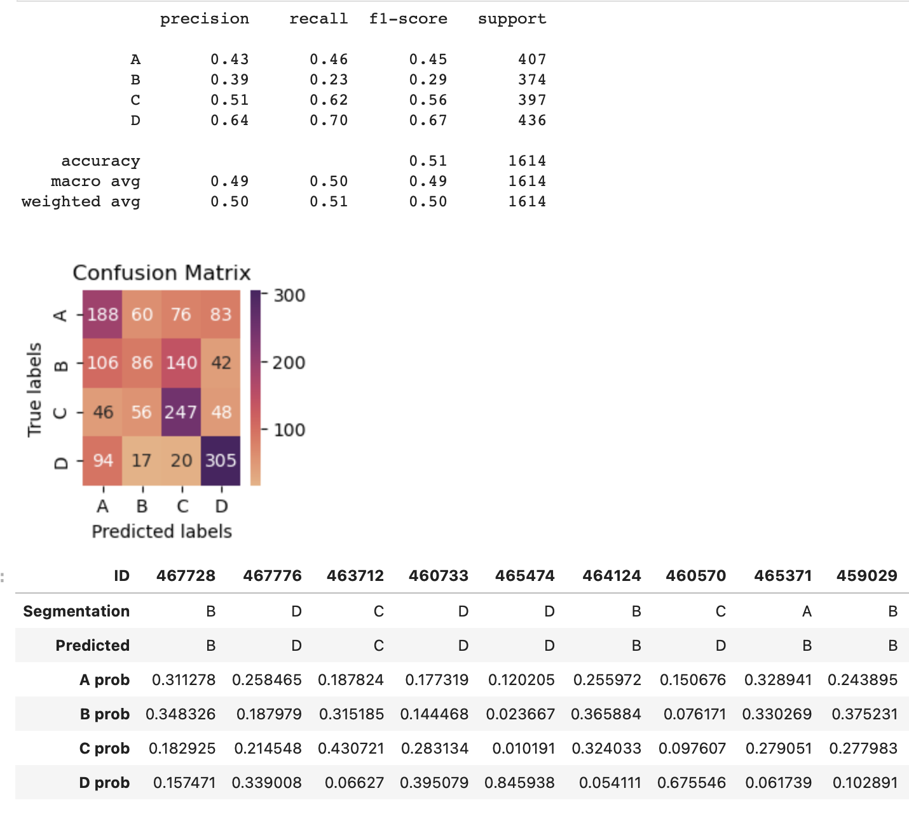

# Client Classification Using Random Forest and Logistic Regression

 

This project focuses on classifying clients into distinct categories based on their behaviors and characteristics. In the modern business environment, understanding and categorizing clients into different segments can significantly aid in personalized marketing and improve customer service. This repository contains code, data, and analysis for a client classification project using the machine learning models Random Forest and Logistic Regression.

## Data

The dataset consists of various client details, like age, work experience, family size, and more. These details have been pre-processed and used to train machine learning models to classify the clients.

## Results

- **Random Forest Classifier**: Achieved an accuracy of around 53% on unseen data.
- **Logistic Regression**: Provided a similar accuracy, with the added advantage of offering class probabilities.

These scores are consistent with top models on Kaggle for this dataset.

## Limitations

- Due to time constraints, there was a rapid exploration of feature engineering possibilities.
- While the dataset is detailed, it has a limited sample size.
- Additional information about the clients might have further improved the model's performance.

## Future Work

This project serves as an initial exploration into client classification using machine learning, but there's ample potential for subsequent work:

1. Experimentation with more sophisticated models or ensemble techniques.
2. Consideration of deep learning methods.
3. The potential collection of more data or integration with external data sources.
4. Further refinement of features and possibly integration of domain-specific insights.

## Contributing

Although this project is primarily a personal endeavor and learning experience, insights or suggestions are always appreciated. Feel free to open an issue or submit a pull request.

## License

This project falls under the MIT License. Refer to the `LICENSE` file for more details.
